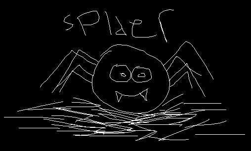

<div align=center>
    </br>
    <i>Spider Status:</i></br>
    
</div>

```
Proper Readme will be available real soon!.

Anyway, i hate spider <^>


I'm real sorry for that bad looking, weird, ugly code.
I know that, so please keep in mind this project is still on alpha.
I have schedule to make the code better, later...
```

## How to add bugs

[Click this]("./AddBug.md")

### Todos

- [ ] Support
  - [x] Vmess
  - [x] Trojan
  - [ ] Shadowsocks(R)
- [x] Release Base64 Encoded Result
- [ ] Codefining

## License

You can read the license [here]("./LICENSE.md"), also for additional information:

```
  This project JUST scrape/scavenge FREE things from the internet.
  I do not know from where and how "these" people get the "things".

  This project aimed to help communities from accessing internet on their own.
  The responsibility return to the end user and all credit return to people that hold the "things".
```
